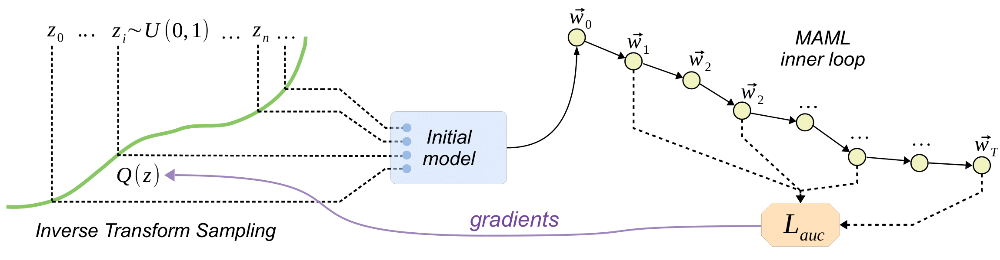

# Discovering Weight Initializers with Meta-Learning

Official implementation of the paper [Discovering Weight Initializers with Meta-Learning](https://openreview.net/forum?id=AwT_WWtEUj) (ICMLW'2021) by Dmitry Baranchuk, and Artem Babenko.

## Overview

The proposed approach (DIMAML) learns task-agnostic initial weight distributions using MAML. Specifically, DIMAML learns initializers by explicitly optimizing the training performance for the given architecture and training setting. 

## Dependencies

* Python >= 3.5
* Packages: see `requirements.txt`

## Run
1. Clone or download this repo. `cd` yourself to it's root directory.
2. Grab or build a working python enviromnent. [Anaconda](https://www.anaconda.com/) works fine.
3. Install packages from `requirements.txt`
4. Download the data: `cd ./notebooks/ && bash download_data.sh` (3.1 Gb)
5. Open jupyter notebook in `./notebooks/` and you're done!
